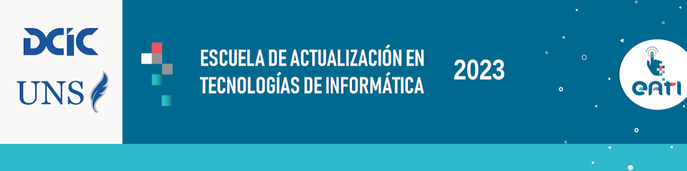

</img>

[🇺🇸 Read in english](README.md)

### EATI 2023: CI/CD Primeros Pasos

En este repositorio hemos probado las Actions que creamos [aquí](https://github.com/matichewer/eati2023-my-action).

___

Este repositorio fue creado para el curso "**DevOps: tu pipeline de CI/CD con Github Actions**" de la "Escuela de Actualización en Tecnologías de la Información" (EATI 2023) a cargo del [Departamento de Ciencias e Ingeniería Informática ( DCIC)](https://cs.uns.edu.ar/) de la [Universidad Nacional del Sur (UNS)](https://uns.edu.ar/).

___

Los repositorios que hemos creado durante el curso son los siguientes:
- https://github.com/matichewer/eati2023-ci-cd-first-steps
- https://github.com/matichewer/eati2023-pipeline
- https://github.com/matichewer/eati2023-my-action/
- https://github.com/matichewer/eati2023-test-my-action
